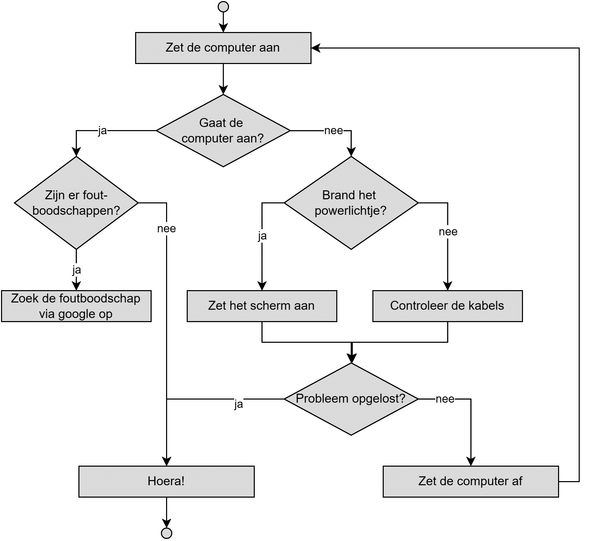

## Oefeningen

### Muziek, deel 2

Eén van de eerste oefeningen die je maakte uit dit boek was de muziek-oefening. We gaan deze oefening nu uitbreiden. 

Zorg ervoor dat iedere noot als een aparte methode kan aangeroepen worden (bv. ``Do()``)`.

Door de frequentie van een toon te vermenigvuldigen of te delen met veelvouden van 2 krijg je de tonen op andere octaven. Pas de ‘noot-methoden’ aan zodat 2 parameters kunnen meegeven worden:

* De lengte in milliseconden dat de toon moet aangehouden worden.
* De octaaf van de toon: 1 = basis octaaf die we al hadden, 2= 2e octaaf (dus frequentie x2) 3= 3e octaaf (frequentie x 4) enz.

Als je dus de tweede octaaf van Do wil spelen (met iedere toon om de 500ms) moet je deze als volgt kunnen aanroepen ``Do(500,2);``.

Maak nu een methode genaamd ``YouAreMySunshine`` die je kan aanroepen om het gelijknamig getiteld liedje af te spelen (het liedje gaat als volgt Re, Sol, La, Si, Si, Si, La, Si, Sol, Sol) gebruikmakend van de eerder aangemaakte noot-methoden. Als extraatje: kan je de *lyrics* op het scherm tonen telkens de noot zal afgespeeld worden?

### Multitool

Maak een multitool-applicatie die wanneer deze opstart aan de gebruiker een menu toont. Afhankelijk van de input van de gebruiker zal er vervolgens een ander stuk uitgevoerd worden. Gebruik voor ieder menuitem een aparte methode en probeer daarbinnen ook maximaal gebruik van methoden te maken. De verschillende keuzes zijn (de gebruiker voert een cijfer in):

* **Menuitem 1 - Rekenmachine**. Indien dit gekozen wordt, zal het programma eerst 2 getallen aan de gebruiker vragen, gevolgd door een keuzemenu waarop de gebruiker een operator kan kiezen (``+,-,*,/,%``). Het programma toont dan het resultaat indien de operator op de twee ingevoerde getallen wordt uitgevoerd. Wanneer de uitkomst negatief is dan zal de uitkomst in het rood worden getoond. 
* **Menuitem 2 - Password tester:** Vraag aan de gebruiker z'n paswoord. Indien dit gelijk is aan "C#ISSOCOOL" zal er een groene tekst "Toegelaten" verschijnen. Zoniet een rode "Verboden" tekst.
* **Menuitem 3 - Recyclage:** Kies eender welk programma dat je uit dit boek hebt gemaakt waarin je input aan de gebruiker ook verwerkt. Plaats dit programma achter dit menuitem
* **Menuitem 4 - Computersolver :** Implementeer de flowchart op de volgende bladzijde waarbij je aan de gebruiker de vragen stelt en hem zo helpt z'n computerprobleem op te lossen.

. 

