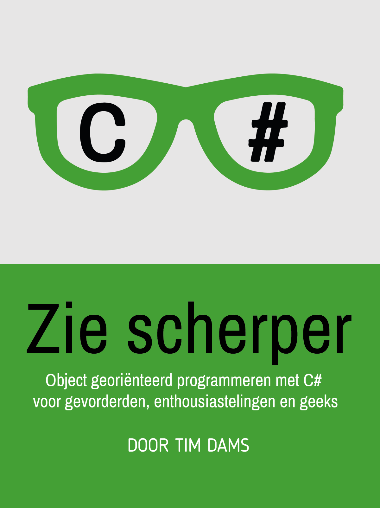

# Zin in meer? "Zie Scherper" wacht op je!

Heb je de smaak te pakken? Aarzel dan niet om deel 2 in deze reeks, **Zie Scherper**, aan te pakken. 
Onderwerpen die aan bod zullen komen:
* Object Oriented Programming (OOP).
* Klassen, objecten, constructors, ``static``, properties, enz.
* Geheugenmanagement, uitzonderingen en namespaces.
* Arrays en klassen
* Overerving, abstracte klassen, ``System.Object´´, enz.
* Compositie en aggregatie
* Polymorfisme
* Interfaces

Meer info via **ziescherp.be**.

