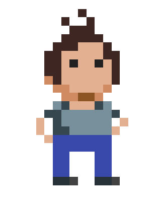

# Welkom

Zo, je hebt besloten om C# te leren? Je bent hier aan het juiste adres. Dit boek wordt gebruikt als handboek binnen de opleidingen professionele bachelor elektronica-ict en toegepaste informatica van de AP Hogeschool. 

Eerst zullen we de fundering leggen en zaken behandelen zoals variabelen, loops methoden en arrays. Vervolgens zal (hopelijk) de mystieke, maar oh zo belangrijke, wereld van het *Object georiënteerd programmeren* uit de doeken gedaan worden.

Je vraagt je misschien af hoe up-to-date dit boek is. Het werd oorspronkelijk samengesteld tijdens de lockdowns in 2020, dus... mmm, het jaar 2020 als kwaliteitslabel gebruiken is een beetje zoals zeggen dat je wijn maakt met rioolwater. Toen eind 2021 een nieuwe versie van Visual Studio verscheen werd het tijd om dit boek grondig te updaten. De versie die je nu in handen hebt werd geüpdatet in de zomer van 2022, een veel fijner jaar dan 2020 ;) 

Net als gesproken talen, evolueert ook de programmeertaal C#. Terwijl ik dit schrijf zijn we aan versie 10.0 van C# en staat versie 11 in de startblokken. Bij iedere nieuwe C#-versie worden bepaalde concepten plots veel eenvoudiger of zelfs gewoon overbodig. Een goede programmeur moet zowel met oude als met nieuwe concepten kunnen werken. Ik heb geprobeerd een goede mix te vinden tussen oud en nieuw, met de nadruk op wat bruikbaar is voor je professionele carrière. Je vindt hier geen extreem nieuwe C# innovaties die slechts in specifieke projecten bruikbaar zijn. Integendeel, ik hoop dat als je aan het laatste hoofdstuk bent, je een zodanige basis hebt, dat je ook zonder problemen in andere 'zustertalen' durft te duiken (zoals Java, C en C++, maar ook zelfs Python of JavaScript).

Dit boek wil niet de hele C#-taal en alles eromheen aanleren. Het is bedoeld voor iedereen die geïnteresseerd is in programmeren, maar mogelijk nog nooit code heeft geschreven. Sommige ingewikkelde concepten voor beginners zijn weggelaten. Bekijk dit boek als een eerste stap naar meer C#, meer programmeertalen en vooral meer programmeerplezier! U weze gewaarschuwd.

Veel lees-en programmeerplezier,

Tim Dams 
Zomer 2022

## Over de bronnen

Dit boek is het resultaat van bijna een decennium C# doceren aan de AP Hogeschool (eerst nog Hogeschool Antwerpen, dan Artesis Hogeschool, dan Artesis Plantijn Hogeschool...). De eerste schrijfsels verschenen op een eigen gehoste blog ("Code van 1001 Nacht", die ondertussen ter ziele is gegaan) en vervolgens kreeg deze een iets strakkere, eenduidige vorm als gitbook cursus. Deze cursus, alsook een hele resem oefeningen en andere nuttige extra's kan je terugvinden op **ziescherp.be**. De inhoud van die cursus loopt integraal gelijk aan die van dit boek. Uiteraard is de kans bestaande dat er in de online versie ondertussen weer wat minder schrijffoutjes staan. 

Waarom deze korte historiek? Wel, de kans is bestaande dat er hier en daar flarden tekst, code voorbeelden, of oefeningen niet origineel de mijne zijn. Ik heb getracht zo goed mogelijk aan te geven wat van waar komt, maar als ik toch iets vergeten ben, aarzel dan niet om me er op te wijzen. 

### Benodigdheden

Alle codevoorbeelden in deze cursus kan je zelf (na)maken met de gratis **Visual Studio 2022 Community** editie die je kan downloaden op **visualstudio.microsoft.com**.

## Dankwoord

Aardig wat mensen - grotendeels mijn eerstejaars studenten van de professionele bachelor Elektronica-ICT  en Toegepaste Informatica van de AP Hogeschool - hebben me met deze cursus geholpen. Hen allemaal afzonderlijk bedanken zou me een extra pagina kosten, en ik heb de meeste al nadrukkelijk bedankt in de vorige editie van dit boek. 

Een speciale dank nogmaals aan Maarten Wachters die de originele pixel-art van me maakte waar ik vervolgens enkele varianten op heb gemaakt.

Ook een bos bloemen voor collega's Olga Coutrin en Walter Van Hoof om de ondankbare taak op zich te nemen mijn vele dt-fouten uit de vorige editie te halen op nog geen week voor de deadline. Bedankt!

De trainers van Multimedi BV. die dit handboek ook gebruiken wil ik expliciet bedanken voor hun nuttige feedback op de eerste versie van dit boek, alsook om mij een extra reden te geven om dit boek in de eerste plaats uit te brengen.

