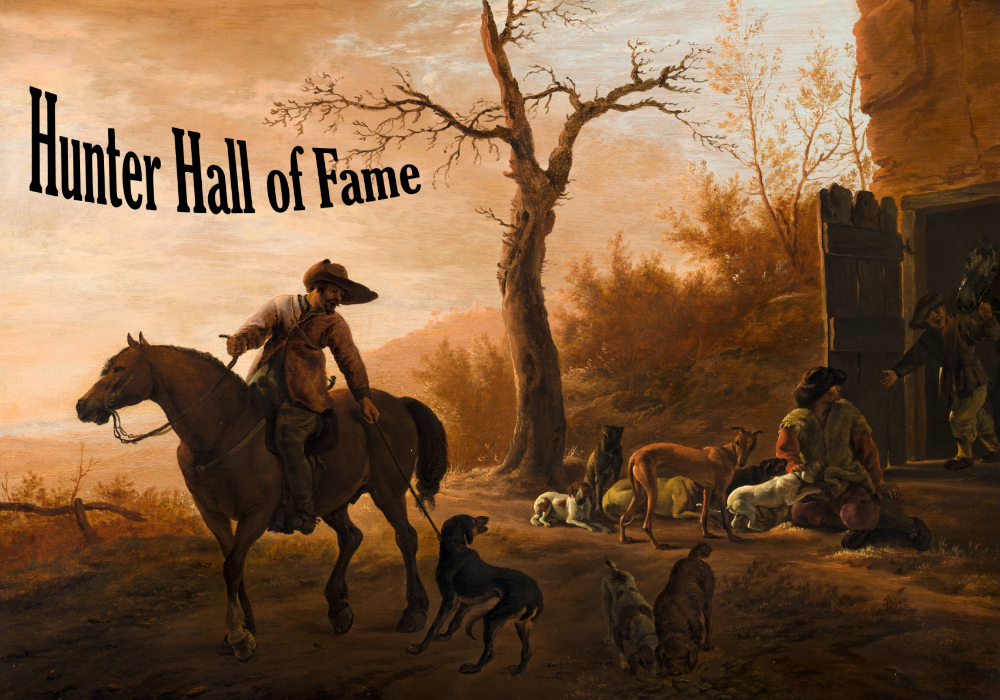

Aardig wat mensen, grotendeels studenten 1EA van 2019-2020, hebben me met dit boek geholpen. **Waarvoor dank!** Hieronder een zo volledige lijst mogelijk van de vele typo-hunters, inputgevers, reviewers en schouderklopjesgevers.

# Externe bronnen
Sommige oefeningen en onderdelen komen van de cursus Programmeren van collega Olga Coutrin.

De slides zijn grotendeels de mijne, toch zal je hier en daar nog stukken vinden die oorspronkelijk in de slides van het handboek ["Programmeren in c# (Bell&Parr)](https://www.pearson.com/nl/nl_NL/hoger-onderwijs/catalogus/informatica/programmeren-in-c-3e-editie-met-mylab-nl.html) vertaald door Kris Hermans (Lector C# van de PXL Hogeschool)

# Ultra editors Hall of Fame

Eerst wil ik vijf studenten apart bedankt voor hun hardcore input in dit boek, namelijk:

* Claeys Ailko
* Van Driel Kevin
* Van Riel Lennert
* Simons Ruben
* Hattas Zeno

Zonder jullie zou dit boek een pak meer fouten, onduidelijkheden en Pokemons in plaats van Pokémons bevatten. Merci heren!

# Typohunters Hall of Fame

dit boek bevat hier en daar enkele typo's. Die zijn er uiteraard bewust *kuch* in geplaatst. Zij die er vinden zullen voor eeuwig in deze hall of fame opgenomen worden. Ere aan de volgende typohunters:

Hendrikx Ben, Van Ingelghem Brian, De Vree Bart, Strauven Wannes, Van Breedam Arne, Yoncalik Arafa, Baeten Tom, Baert Jonas, Teka Sala Brian, Schrauwen Stijn, Ahmad Saqib Shan, Sinogba Russel, Brosens Laurens, Kramp Thomas

Keep'm coming!
