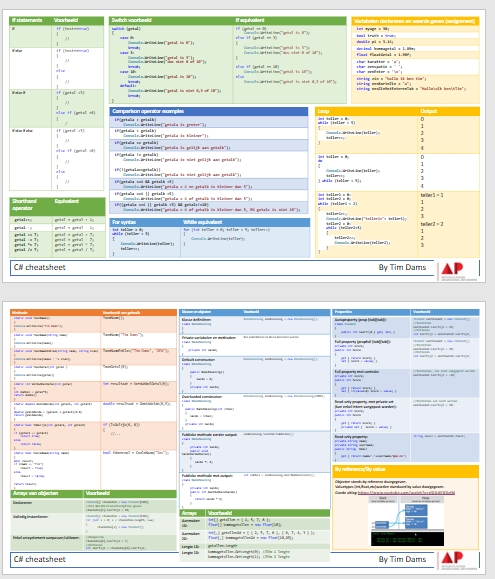

# Nuttige extra's

Er werden 2 Memrise cursussen aangemaakt speciaal voor dit handboek.  **Opgelet: je kan je enkel via de browser inschrijven op niet-spreektaal-cursussen. De app toont enkel spreektaalcursussen**. Gebruik deze app om dagelijks 5 minuten je C# kennis te drillen:
  * [Deel 1](https://app.memrise.com/course/6382184/zie-scherp-scherper-programmeren-in-c-deel-1/)
  * [Deel 2](https://app.memrise.com/course/6383638/zie-scherp-scherper-programmeren-in-c-deel-2/) 

# Boeken

Er zijn quasi oneindig veel boeken over C# geschreven, althans zo lijkt het. Hier een selectie van boeken met een korte bespreking waarom ik denk dat ze voor jou een meerwaarde kunnen zijn bij het leren programmeren in C#:

## Beginner boeken

* [C# Programming](https://ineasysteps.com/products-page/all_books/c-sharp-programming-in-easy-steps/) van Mike McGrath: een uiterst compact, maar zeer helder en kleurrijk boekje dat ik ten stelligste aanbeveel als je wat last hebt met de materie van de eerste weken.
* [Head First C#](https://www.bol.com/nl/f/head-first-c/37019965/?country=BE) van Andrew Stellman & Jennifer Greene: laat de ietwat bizarre, bijna kleuterachtige look and feel van de head first boeken je niet afschrikken. Ieder boek in deze serie is goud waar. De head first boeken zijn de ideale manier als je zoekt naar een alternatieve manier om complexe materie te begrijpen. Bekijk zeker ook de Head First Design Patterns en Head First Sql boeken in de reeks!

# Online 

Leren programmeren door enkele de opdrachten in dit boek te maken zal je niet ver (genoeg) brengen. Onze dikke vriend het Internet heeft echter tal van schitterende bronnen. Hier een overzicht.

## Cheat sheet

Volgende document bevat een overzicht van de basis C# syntax zaken van het eerste en (deel van het) tweede semester: [download hier](https://timdams.files.wordpress.com/2022/08/cheat-sheet.pdf)

## Game-based leren programmeren

Ideale manier om programmeren meer in de vingers te krijgen op een speelse manier:

* [Exercism](https://exercism.io/tracks/csharp)
* [Code Wars](https://www.codewars.com/r/WVzAtA)
* [Coding game](https://www.codingame.com/start) zeer vet
* [Code Combat](https://codecombat.com/)

## Tutorials

* [Freecodecamp.org C# tutorial](https://www.youtube.com/watch?v=GhQdlIFylQ8) Zeer erge aanrader!
* [Microsoft C# tutorial](https://docs.microsoft.com/nl-nl/learn/paths/csharp-first-steps/) Zeer interactief én in het Nederlands. Aanrader.
* [Johnny does Dotnet](https://www.youtube.com/channel/UCPvA9d7Ji-k8xbAk9KNemew)
